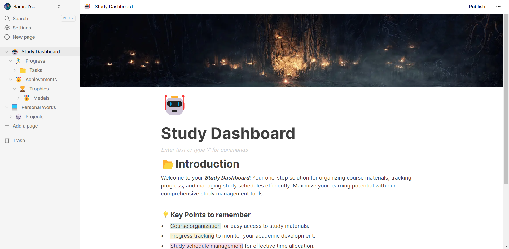

# ScribeSync

ScribeSync, powered by Next.js and Vercel, is the ultimate platform for seamless note-taking and collaborative work. Experience unparalleled speed, security, and performance while managing your ideas and projects effortlessly.



<!-- TABLE OF CONTENTS -->
<details>
  <summary>Table of Contents</summary>
  <ol>
    <li>
      <a href="#about-the-project">About The Project</a>
      <ul>
        <li><a href="#built-with">Built With</a></li>
      </ul>
    </li>
    <li>
      <a href="#getting-started">Getting Started</a>
      <ul>
        <li><a href="#prerequisites">Prerequisites</a></li>
        <li><a href="#installation">Installation</a></li>
      </ul>
    </li>
    <li><a href="#features">Features</a></li>
    <li><a href="#contributing">Contributing</a></li>
    <li><a href="#license">License</a></li>
    <li><a href="#view-demo">View Demo</a></li>
    <li><a href="#contact">Contact</a></li>
  </ol>
</details>

### Built With

- [React](https://reactjs.org/)
- [NextJs](https://nextjs.org/)
- [Tailwind](https://tailwindcss.com/)
- [Convex](https://convex.dev/)
- [EdgeStore](https://edgestore.dev/)

## Getting Started

### Prerequisites

Install [Nodejs](https://nodejs.org/en/) from the official site.
Create account in [Convex](https://convex.dev/) and [EdgeStore](https://edgestore.dev/) to get started with the api for backend.

### Installation

_Follow the following steps to install and setup the virtual environment._

1. Clone the repo
   ```sh
   git clone https://github.com/Samrat-14/scribe-sync.git
   ```
2. Once inside the cloned repo, get started with installing the node modules.
   ```sh
   npm install
   ```
3. Start the server for frontend.
   ```sh
   npm run dev
   ```
4. Start the server for backend.
   ```sh
   npm convex dev
   ```
5. After the installments are over and the server is running, you can get started with the project.

## Features

- **Effortless Organization and Structuring:** Effortlessly manage and structure your notes, documents, and tasks with a versatile organizational system, allowing for customizable layouts and categorization.
- **Real-Time Editing for Seamless Teamwork:** Facilitate seamless teamwork with real-time editing, enabling multiple users to view shared documents simultaneously, fostering efficient communication and productivity.
- **Multimedia Integration for Enhanced Notes:** Enhance your notes with multimedia elements, including images to create engaging and dynamic content that captures ideas in various formats.
- **Diverse Customizable Templates:** Choose from a diverse range of customizable templates tailored for different use cases, ensuring quick and efficient initiation of projects, tasks, and workflows to suit individual preferences and requirements.
- **Cross-Platform Synchronization with ScribeSync:** Access ScribeSync from various devices and operating systems, ensuring that your notes and data are synchronized across multiple platforms, allowing for convenient and on-the-go access to your information.

## Contributing

I love contributions, so please feel free to fix bugs, improve things, provide documentation.
If you have a suggestion that would make this better, please fork the repo and create a pull request. You can also simply open an issue with the tag "enhancement".
Don't forget to give the project a star! Thanks again!

1. Fork the Project
2. Create your Feature Branch (`git checkout -b feature/AmazingFeature`)
3. Commit your Changes (`git commit -m 'Add some AmazingFeature'`)
4. Push to the Branch (`git push origin feature/AmazingFeature`)
5. Open a Pull Request

<!-- LICENSE -->

## License

Distributed under the MIT License. See `LICENSE` for more information.

## View Demo

Live Demo: [https://samrat-scribesync.vercel.app/](https://samrat-scribesync.vercel.app)

## Contact

Your Name - [Samrat Sadhu](https://samrat-sadhu-portfolio.vercel.app/) - ss2414@ece.jgec.ac.in
